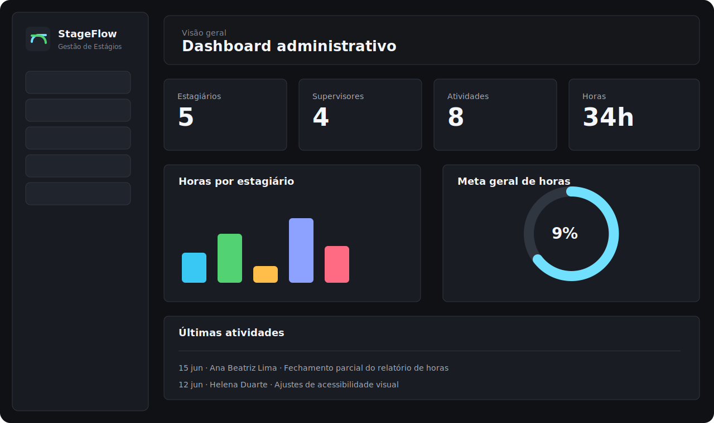

# StageFlow




**StageFlow** é um sistema web para gestão de estágios desenvolvido como projeto acadêmico de inovação no contexto do **Estágio Supervisionado Obrigatório**. A proposta organiza cadastros, atividades, frequência, carga horária e relatórios gerenciais em uma interface única, com foco em uma rotina de acompanhamento acadêmico da **UNIC - Universidade de Cuiabá**.

O projeto foi construído para portfólio com uma base de acompanhamento preparada para navegação completa. A aplicação funciona de forma estática, pronta para publicação no GitHub Pages.

> Todos os dados exibidos nesta versão são simulados. O projeto principal desenvolvido durante o estágio supervisionado permanece privado por envolver rotinas internas e informações institucionais.

## Objetivo

O StageFlow centraliza informações que normalmente ficam espalhadas entre planilhas, fichas de acompanhamento e documentos acadêmicos. A interface permite acompanhar estudantes, supervisores, atividades desenvolvidas, frequência diária e progresso de carga horária com uma experiência próxima de um sistema institucional.

## Contexto Acadêmico

A solução simula uma necessidade comum em estágios supervisionados da área de tecnologia: registrar atividades, acompanhar horas cumpridas, validar presença e gerar relatórios para coordenação, orientadores e supervisores.

Os registros foram organizados com nomes, cursos, telefones com DDD 65, datas entre **20/08/2025** e **17/09/2025**, horários de **08:00 às 14:00** e atividades relacionadas à rotina de estágio em TI em Cuiabá/MT.

## Identidade Visual

A marca do StageFlow foi desenhada como um monograma próprio e minimalista: o traço contínuo em forma de **S** representa a jornada do estágio, o fluxo dos registros e a evolução das horas acompanhadas. A leitura simples foi pensada para funcionar bem como favicon, sidebar e identidade de um sistema acadêmico moderno.

## Funcionalidades

- Dashboard administrativo com métricas, progresso de horas e indicadores visuais.
- Cadastro de estagiários com consulta, status, supervisores vinculados e progresso acadêmico.
- Cadastro de supervisores com setor, contato, alunos acompanhados e atividades relacionadas.
- Registro de atividades com categoria, período, carga horária e detalhes completos.
- Controle de frequência com filtros, presenças, ausências, horas e percentual de acompanhamento.
- Relatórios geral, individual, por período, de frequência e de atividades.
- Exportação de relatório em PDF com formato acadêmico.
- Configurações de tema, densidade visual, animações, instituição exibida e carga horária padrão.
- Tema claro, tema escuro e opção de seguir a preferência do navegador.
- Painéis de detalhes ao clicar em alunos, supervisores, atividades e registros de frequência.

## Tecnologias

- HTML5
- CSS3
- JavaScript ES6+
- Bootstrap 5
- Chart.js
- jsPDF
- Persistência local no navegador

## Estrutura

```text
StageFlow/
|-- index.html
|-- pages/
|   |-- projeto.html
|   |-- dashboard.html
|   |-- estagiarios.html
|   |-- supervisores.html
|   |-- atividades.html
|   |-- frequencia.html
|   |-- relatorios.html
|   `-- configuracoes.html
|-- assets/
|   |-- css/
|   |   |-- main.css
|   |   |-- components.css
|   |   `-- pages/
|   |-- images/
|   |   |-- logo-stageflow.svg
|   |   |-- logo-unic.png
|   |   |-- logo-unic-mark.png
|   |   `-- screenshots/
|   `-- js/
|       |-- app.js
|       |-- storage.js
|       |-- ui.js
|       |-- pdf.js
|       |-- rescuePanel.js
|       |-- data/
|       `-- pages/
|-- docs/
|-- README.md
|-- LICENSE
`-- package.json
```

## Como Executar

Na raiz do projeto, execute:

```bash
python -m http.server 5500
```

Depois acesse:

```text
http://127.0.0.1:5500/index.html
```

Painel administrativo:

```text
http://127.0.0.1:5500/pages/dashboard.html?v=7
```

## Publicação

O StageFlow pode ser publicado diretamente no GitHub Pages a partir da raiz do repositório. A página inicial é `index.html`, e as telas internas ficam no diretório `pages`.

## Aprendizados

- Organização de um projeto front-end estático com módulos JavaScript.
- Separação entre dados, componentes de interface, páginas e relatórios.
- Construção de dashboard com indicadores e gráficos.
- Implementação de preferências visuais persistentes.
- Geração de relatórios em PDF.
- Modelagem de uma experiência acadêmica voltada para acompanhamento de estágio.
- Cuidado com responsividade, contraste, microinterações e linguagem institucional.

## Melhorias Futuras

- Autenticação por perfil de usuário.
- Integração com serviços acadêmicos.
- Histórico de alterações por registro.
- Upload e conferência de documentos de estágio.
- Assinaturas digitais em relatórios.
- Painel específico para supervisores externos.

## Licença

Distribuído sob licença MIT. Consulte o arquivo [LICENSE](LICENSE).
